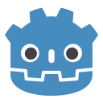
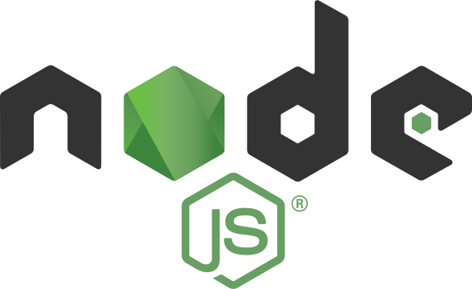
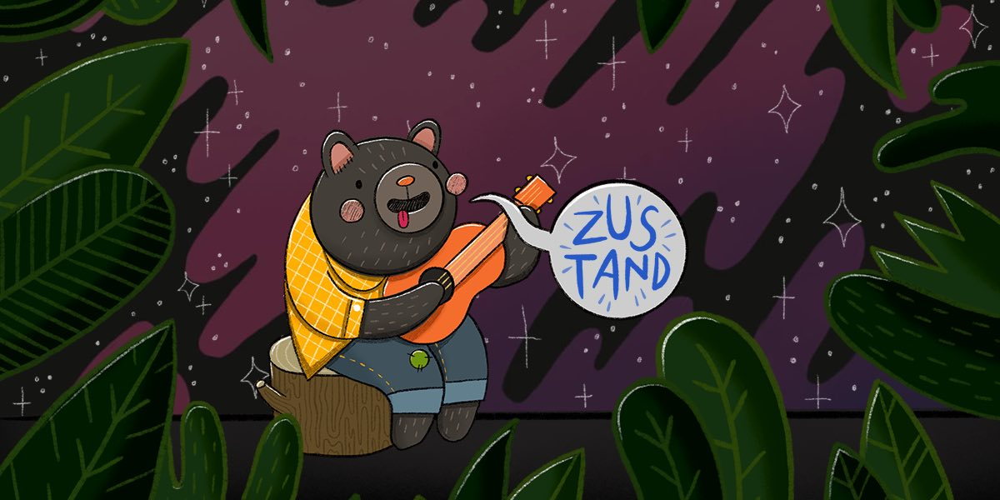
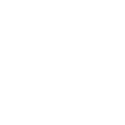
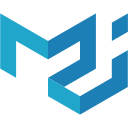
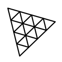
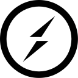

  
  
  

<!--
-   👯 I’m looking to collaborate on ...
-   🤔 I’m looking for help with ...
-   📫 How to reach me: ...
-   😄 Pronouns: ...
-   ⚡ Fun fact: ...
-->

- 💻 I love learn new technologies 💻,
  A hobbyist game 🎮, AI 🤖 and XR 🥽 developer.
- 🔭 I’m currently working on A Game Engine
- 🌱 I’m currently learning Angular and .NET
- 💬 Ask me about anything [here](https://github.com/Ulrich-Tonmoy/ulrich-tonmoy/issues) or [portfolio](https://ulrich-tonmoy.github.io/) or [discord](https://discord.gg/3PXDND5e) or [youtube](https://www.youtube.com/@ulrich-tonmoy)

  
  

  
 
 

<h1 align="center">💻 Languages, Frameworks & Tools 💻</h1>

  
  
  
  
  
  
  
  
  
  
  
  
  
  
  
  
  
  
  
  
  
  
  
  
  
  
  
  
  
  
  
  
  
  
  
  
  
  
  
  
  
  
  
  
  
  

<h1 align="center">🏆 Trophies 🏆</h1>

<h1 align="center">📊 Stats 📊</h1>

<h1 align="center">🔥 Contributions 🔥 </h1>

<h1 align="center">👀 Visitors 👀</h1>

Counting of visitors started from January 1, 2023.
 
 

