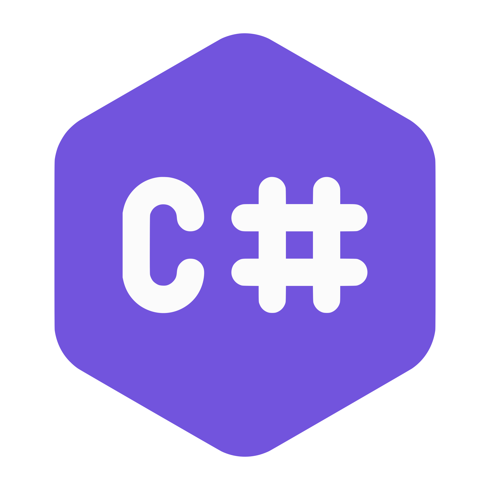
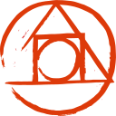
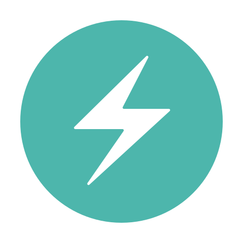

<h1 align="center">
  
</h1>

<!--
-   🔭 I’m currently working on ...
-   🌱 I’m currently learning ...
-   👯 I’m looking to collaborate on ...
-   🤔 I’m looking for help with ...
-   💬 Ask me about ...
-   📫 How to reach me: ...
-   😄 Pronouns: ...
-   ⚡ Fun fact: ...
-->

- 💻 I love writing code and learn anythings about it
- 💬 Ask me about anything [here](https://github.com/Ulrich-Tonmoy/ulrich-tonmoy/issues)

## **links:**

 
 

  
  

  
 
 

<h2 align="center">   ⚡ Languages, Frameworks & Tools ⚡</h2>

<code></code>
<code></code>
<code></code>
<code></code>
<code></code>
<code></code>
<code></code>
<code></code>
<code></code>
<code></code>
<code></code>
<code></code>
<code></code>
<code></code>
<code></code>
<code></code>
<code></code>
<code></code>
<code></code>
<code></code>
<code></code>
<code></code>
<code></code>
<code></code>
<code></code>
<code></code>
<code></code>
<code></code>
<code></code>
<code></code>
<code></code>
<code></code>
<code></code>
<code></code>
<code></code>
<code></code>
<code></code>
<code></code>
<code></code>
<code></code>
<code></code>
<code></code>
<code></code>
<code></code>

<h1 align="center"> 🏆 Trophies 🏆</h1>

<h1 align="center"> 📊 Stats 📊</h1>

<h1 align="center"> 🔥 Contributions 🔥</h1>

<h1 align="center"> 👀 Visitors 👀</h1>
Counting of visitors started from January 1, 2023.
 
 

