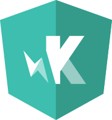

  
  
  

- 💻 Passionate about web development.
- 🎮 Enthusiastic about game development.
- 🤖 Interested in AI & 🥽 XR technologies.
  <!-- - 🌱 I’m currently learning [Zig](https://ziglang.org/). -->
  <!-- - 🔭 I’m currently working on [Codium](https://github.com/Ulrich-Tonmoy/codium) & [Markpad](https://github.com/Ulrich-Tonmoy/markpad). -->
- 💬 Ask me about anything [here](https://github.com/Ulrich-Tonmoy/ulrich-tonmoy/issues) or [discord](https://discord.gg/3PXDND5e) or [youtube](https://www.youtube.com/@ulrich-tonmoy).

  
  

  
 
 

<h1 align="center">💻 Languages, Frameworks & Tools 💻</h1>

  
  
  
  
  
  
  
  
  
  
  
  
  
  
  
  
  
  
  
  
  
  
  
  
  
  
  
  
  
  
  
  
  
  
  
  
  
  
  
  
  
  
  
  
  
  
  
  
  
  
  
  
  
  
  
  
  
  
  
  
  
  

<h1 align="center">🏆 Trophies 🏆</h1>

<h1 align="center">📊 Stats 📊</h1>

<h1 align="center">🔥 Contributions 🔥 </h1>

<h1 align="center">👀 Visitors 👀</h1>

Counting of visitors started from January 1, 2023.
 
 

